# Żarłometr

Aplikacja do śledzenia spożytych posiłków, makroskładników i postępów w realizacji celów dietetycznych.

## Stos technologiczny

- **React 18** + **Vite**
- **React Router 6** (BrowserRouter, chronione trasy, zagnieżdżony routing przez `<Outlet />`)
- **Firebase Authentication** (Email/Password + Google) i **Firestore** na dane użytkownika
- **react-ga4** — Google Analytics
- **@hotjar/browser** — Hotjar
- Własne style CSS (bez frameworka) w [app/src/styles/](app/src/styles/)

## Struktura projektu

```
app/
├── src/
│   ├── components/    # komponenty reużywalne (UI, layout, ikony)
│   │   ├── ui/        # Button, Card, TextField, Toggle, GoogleButton, AuthDivider
│   │   ├── layout/    # AppShell (wspólny layout z nawigacją i topbarem)
│   │   ├── icons/
│   │   ├── AnalyticsListener.jsx
│   │   ├── PageTransition.jsx
│   │   ├── MealReminder.jsx
│   │   └── RecipeDetailsModal.jsx
│   ├── pages/
│   │   ├── auth/      # LoginPage, RegisterPage
│   │   ├── app/       # DashboardPage, JournalPage, AddMealPage, RecipesPage,
│   │   │              # NewRecipePage, ProgressPage, ProfilePage, SettingsPage,
│   │   │              # OnboardingPage
│   │   └── NotFoundPage.jsx
│   ├── context/       # AuthContext
│   ├── lib/           # analytics.js, journalRepo.js, recipesRepo.js, ingredients.js
│   ├── styles/        # CSS per widok + global.css
│   ├── firebase.js
│   ├── App.jsx
│   └── main.jsx
└── package.json
```

## Uruchomienie lokalne

```bash
cd app
npm install
npm run dev
```

W `.env.local` (w katalogu `app/`) ustaw klucze:

```
VITE_FIREBASE_API_KEY=...
VITE_FIREBASE_AUTH_DOMAIN=...
VITE_FIREBASE_PROJECT_ID=...
VITE_FIREBASE_STORAGE_BUCKET=...
VITE_FIREBASE_MESSAGING_SENDER_ID=...
VITE_FIREBASE_APP_ID=...
VITE_GA_ID=G-XXXXXXXXXX
VITE_HOTJAR_ID=XXXXXXX
```

Tryb dev bez Firebase: `VITE_NO_FIREBASE=true` w `.env.local` — logowanie omija Firebase i trzyma usera w `localStorage`.

---

## Zrzuty ekranu aplikacji

### Logowanie (Firebase Authentication)

Formularz logowania z polami email/hasło, linkiem do odzyskiwania hasła, alternatywnym logowaniem przez Google oraz odnośnikiem do rejestracji. Obsługa błędów Firebase Auth.

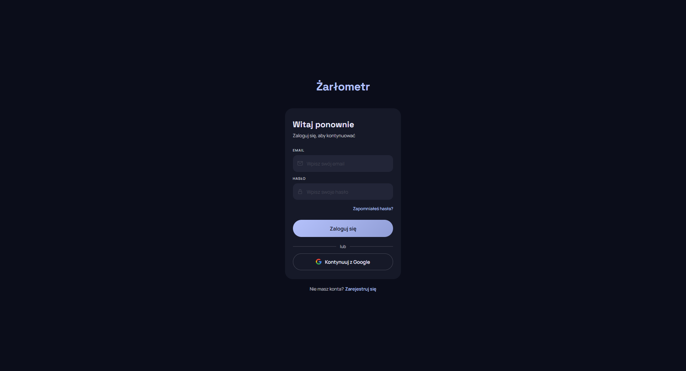

### Dashboard (`/`)

Główny widok po zalogowaniu. Pierścień postępu kalorycznego (spożyto / cel / pozostało), paski makroskładników (białko, węglowodany, tłuszcze), kafelki nawodnienia i kroków, sekcja ostatniego posiłku.

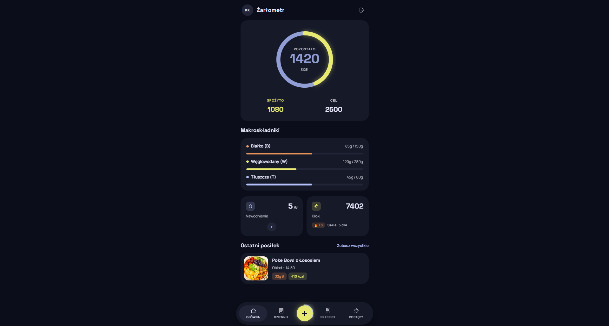

### Dziennik (`/journal`, `/journal/:date`)

Dziennik posiłków z nawigacją po dniach. Każdy posiłek (Śniadanie, II śniadanie, Obiad, Podwieczorek, Kolacja) pokazuje listę produktów z ilością i kaloriami; na dole zsumowane makro całego dnia.

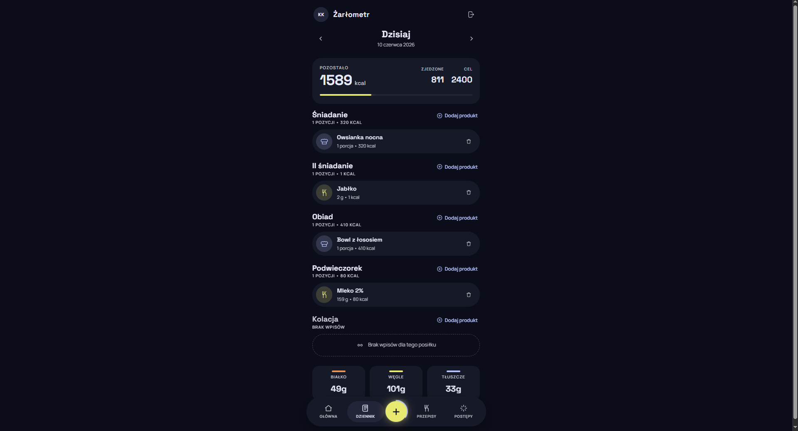

### Przepisy (`/recipes`)

Lista przepisów użytkownika z miniaturą zdjęcia, kalorycznością na porcję i makro. Przycisk „Utwórz nowy przepis” prowadzi do formularza.

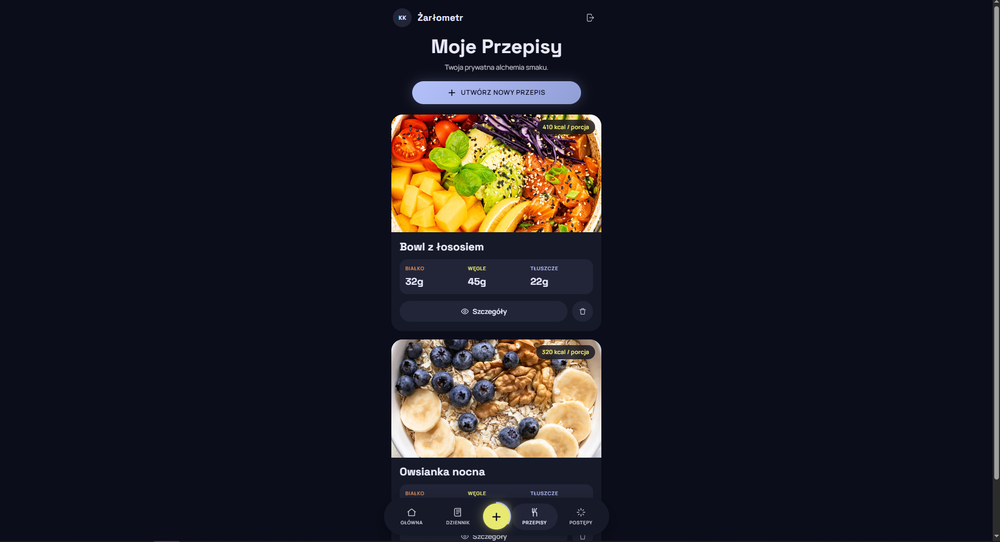

### Nowy przepis (`/recipes/new`)

Formularz dodawania przepisu: nazwa, dynamicznie dodawane składniki z bazy z wyszukiwarką, automatyczne przeliczanie kcal/porcja oraz makroskładników.

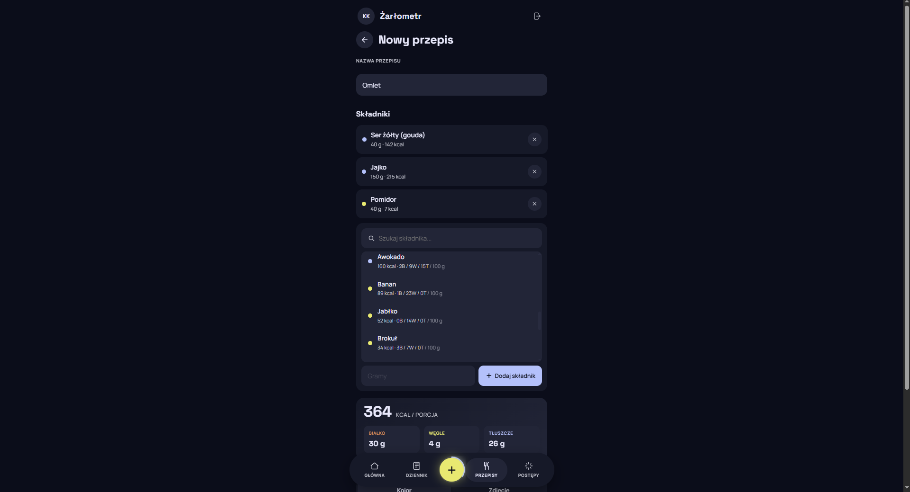

### Ustawienia — dane i parametry (`/settings`)

Sekcje „Dane osobowe” (imię, nickname, email zarządzany przez Google) oraz „Parametry” (waga, wzrost, wiek). Pola input z jednolitym stylem.

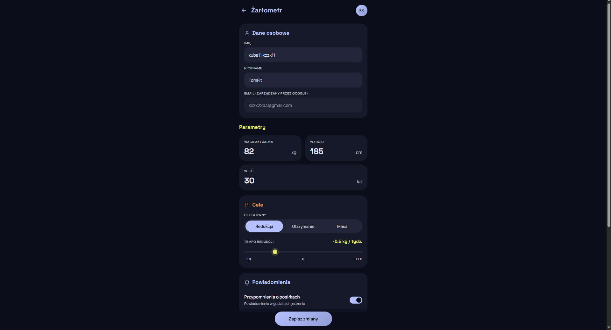

### Ustawienia — cele, powiadomienia, integracje

Wybór celu głównego (Redukcja / Utrzymanie / Masa), suwak tempa redukcji, przełączniki powiadomień, integracje z Apple Health / Google Fit oraz przycisk wylogowania.

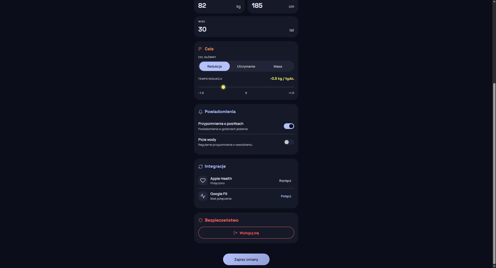

---

## Google Analytics

Integracja zrealizowana przez `react-ga4`. Inicjalizacja w [app/src/lib/analytics.js](app/src/lib/analytics.js), a śledzenie `pageview` na każdą zmianę trasy w [app/src/components/AnalyticsListener.jsx](app/src/components/AnalyticsListener.jsx).

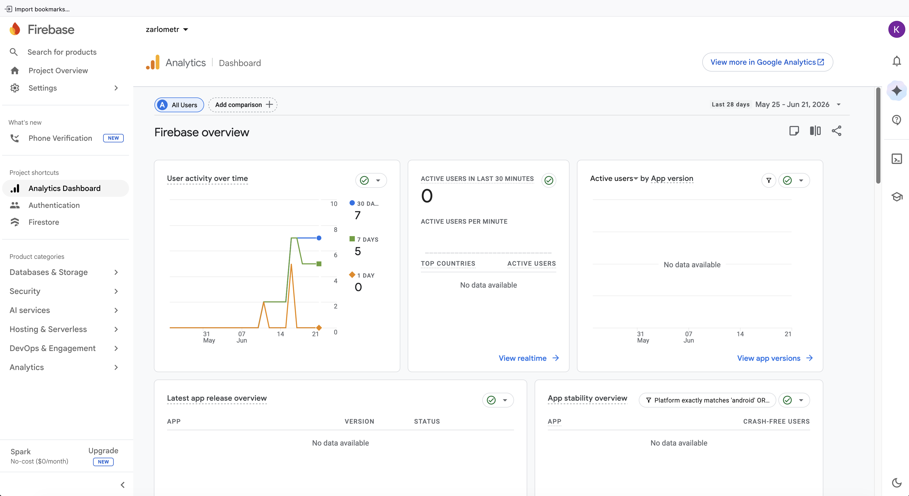

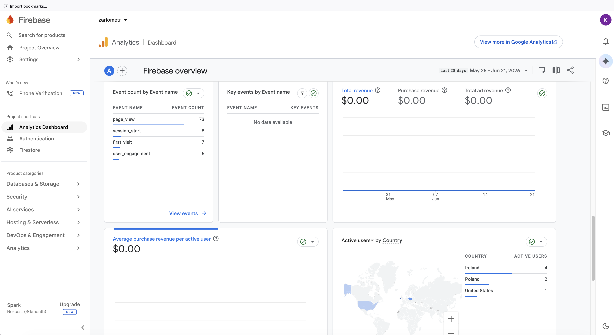

## Hotjar

Hotjar to narzędzie do analizy zachowań użytkowników, które pozwala na:
- **Nagrywanie sesji** — odtwarzanie rzeczywistych interakcji użytkowników z aplikacją (kliknięcia, scrolling, ruchy myszką)
- **Heatmapy** — wizualizacja miejsc, w które użytkownicy najczęściej klikają i jak daleko przewijają strony
- **Wykrywanie problemów UX** — identyfikacja miejsc, gdzie użytkownicy napotykają trudności lub porzucają proces

Inicjalizacja w [app/src/lib/analytics.js](app/src/lib/analytics.js#L15-L21) (funkcja `initHotjar`) wywoływana w [app/src/App.jsx](app/src/App.jsx#L88). ID czytane z `VITE_HOTJAR_ID`.

### Lista sesji użytkowników

Podgląd wszystkich nagranych sesji z podstawowymi informacjami: czas trwania, liczba pageviews, urządzenie, lokalizacja.

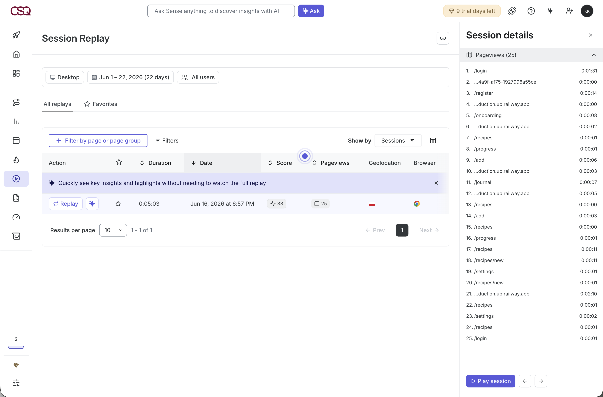

### Odtwarzanie sesji (Session Replay)

Nagranie rzeczywistej sesji użytkownika pokazujące sekwencję akcji, odwiedzonych stron i interakcji z interfejsem.

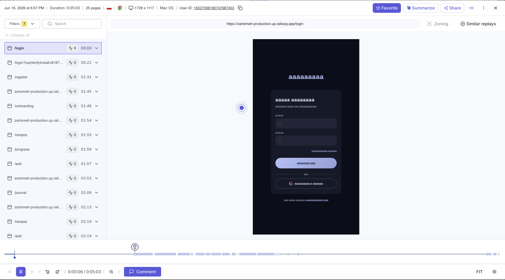

---

## Deploy

Aplikacja przygotowana pod Railway (skrypt `start` + `railway.json` w katalogu `app/`).

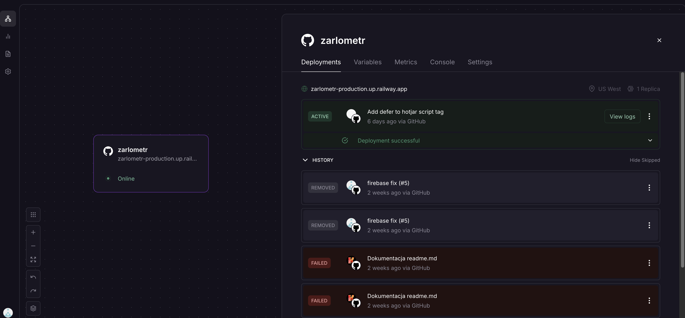

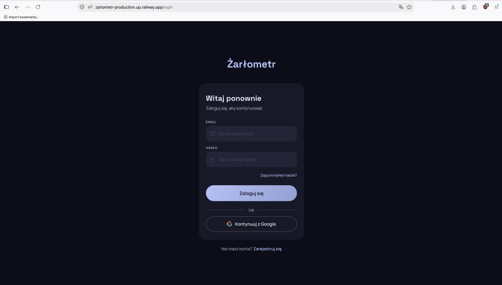
